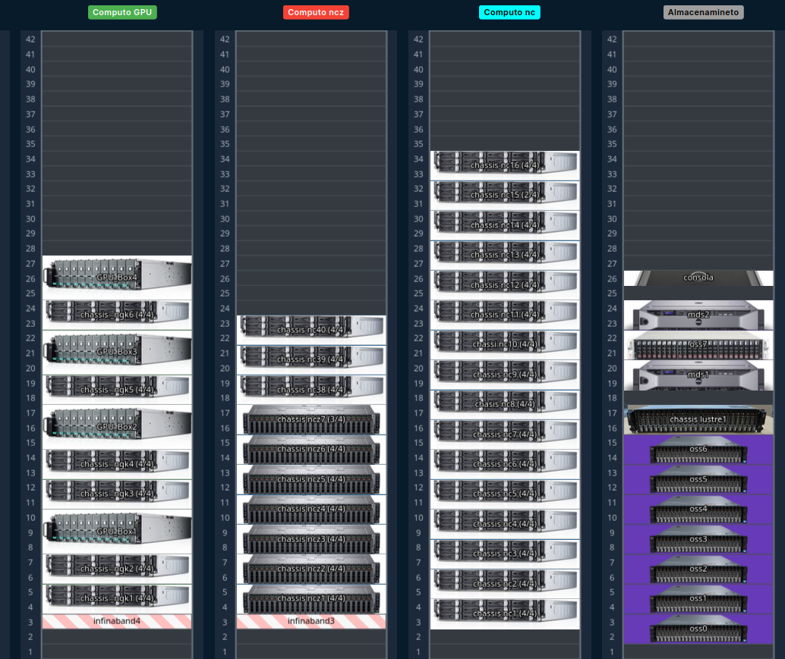

# Infraestructura
## Cluster Yoltla

El cluster `Yoltla`, cuyo nombre deriva del vocablo náhuatl ***Yoltlamaltini*** 
y que significa ***“semillero del saber o conocimiento”***

## Tipos de nodos
- Nodos de login
- Nodos nc
- Nodos ttv1
- Nodos ttv2
- Nodos ncz
- Nodos ngk
- Nodos ngv

## Nodos Yoltla/login
- 2 Nodos
    - Intel(R) Xeon(R) CPU E5-2695 v2 @ 2.40GHz
    - 48 CPUs (hilos Virtuales)
    - 94 GB RAM

---

## Nodos nc
Particiones: q1h-20p, q1h-160p...
- 120 Nodos
    - Intel(R) Xeon(R) CPU E5-2670 v2 @ 2.50GHz
    - 20 CPUs
    - 64 GB RAM
- Orientado a aplicaciones de memoria compartida y distribuida poco demandantes

---

## Nodos ncz
Particiones: qz2d-64p, qz12h-768p...
- 27 Nodos
    - AMD EPYC 7513 @ 2.6GHz
    - 64 CPUs
    - 512 GB RAM

- Orientado a aplicaciones de memoria compartida y distribuida demandantes

---

---

## Nodos ttv1
Particiones: tt2d-80p, tt12h-320p (multiplos de 20)
- 58 Nodos
    - Intel(R) Xeon(R) CPU E5-2660 v3 @ 2.60GHz
    - 20 CPUs
    - 128 GB RAM
- Orientado a aplicaciones de memoria distribuida

---

## Nodos ttv2
Particiones: tt2d-64p, tt1d-512p (multiplos de 32)
- 46 Nodos
    - Intel(R) Xeon(R) CPU E5-2683 v4 @ 2.10GHz
    - 32 CPUs
    - 256 GB RAM
- Orientado a aplicaciones de memoria distribuida

---

## Nodos ngk
Particiones: gpus
- 20 Nodos
    - Intel(R) Xeon(R) CPU E5-2670 v2 @ 2.50GHz
    - Nvidia k20 (2/4)
    - 20 CPUs
    - 64 GB RAM
- Destinado a tareas que requieran uso de GPUs poco demandantes

---

## Nodos ngv
Particiones: vgpus
- 2 nodos
    - Intel(R) Xeon(R) Gold 6140 CPU @ 2.30GHz
    - 36 CPUs
    - GPU Nvidia V100-SXM2  16GB (2/4)
    - 256 GB
- Destinado a tareas que requieran uso de GPUs demandantes

---

## Clúster Yoltla

- 216.5 TFlops
- 6592 CPUs
- 287 nodos
- 95 TB almacenamiento LUSTRE
- Red Infiniband FDR 40Gb/s
