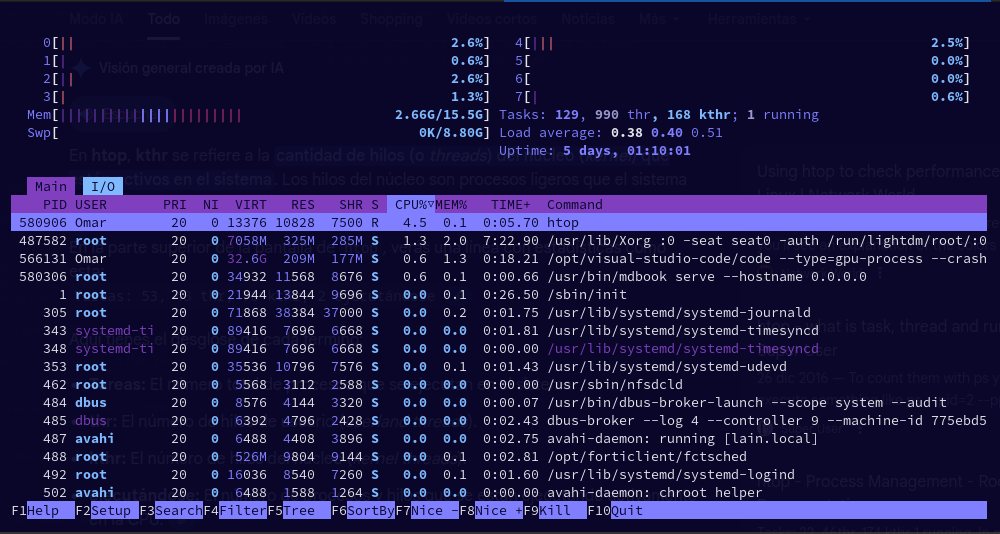

# Uso de SLURM
## ¿Qué es SLURM?
> **SLURM** (Simple Linux Utility for Resource Management) es un sistema de
> gestión de trabajos y recursos de código abierto utilizado en clusters
> de computación de alto rendimiento (HPC).

Características principales:

- **Gestor de colas:** Organiza y planifica la ejecución de trabajos.
- **Administrador de recursos:** Asigna CPU, memoria, GPU y otros recursos.

---

## Comandos de SLURM

#### sinfo - Información del estado del cluster

`sinfo` muestra información sobre los nodos y particiones del cluster. Con esta 
herramienta se puede consultar el estado de los recursos disponibles, como CPUs, 
memoria, tiempo máximo de ejecución y disponibilidad de los nodos.

```bash
    # Sintaxis básica.
    sinfo [opciones]
```

Si se ejecuta **sinfo** sin opciones, mostrará una vista general de las particiones y 
sus estados.

```bash
    [pepe@yoltla0 ~]$ sinfo

    PARTITION  AVAIL  TIMELIMIT  NODES  STATE NODELIST
    q1h-20p*      up    1:00:00      1  inval nc84
    q1h-20p*      up    1:00:00     10 drain$ nc[7,9-12,21,69-72]
    q1h-20p*      up    1:00:00      2 drain* nc[17,50]
    q1h-20p*      up    1:00:00      1  drain nc43
    q1h-20p*      up    1:00:00     65  alloc nc[2-5,8,13-16,23-24,26]
    q1d-20p       up 1-00:00:00     14  down* nc[18,20,22,27-28,33-34]
    q1d-20p       up 1-00:00:00      6   drng nc[19,55,61,67,80,99]
    q1d-20p       up 1-00:00:00      1  drain nc43
```

En la siguiente tabla se da una descripción de los campos que conforman la salida anterior:

|   **Campo**   |   **Descripción** |
|:-------------:|-------------------|
|   `PARTITION` |   Nombre de la partición.|
|   `AVAIL`     |   Estado de la partición.|
|   `TIMELIMIT` |   Tiempo máximo de ejecución para cualquier trabajo.|
|   `NODES`     |   Número de nodos en la partición.|
|   `STATE`     |   Estado actual de los nodos (por ejemplo, `idle`, `alloc`, `mix`, `down`).|
|   `NODELIST`  |   Lista de nodos que conforman la partición.|

Estados de los nodos: 

|   **Estado**   |   **Descripción** |
|:--------------:|-------------------|
| `idle`  | Nodo libre, sin trabajos asignados. | 
| `alloc` | Nodo completamente asignado de trabajos. |
| `mix`   | Nodo parcialmente ocupado. |
| `down`  | Nodo fuera de servicio. |
| `drain` | Nodo deshabilitado para nuevos trabajos (por mantenimeinto o error). |

**Ejemplos de uso**
```bash
    # Mostrar particiones especificas. 
    sinfo -p particion1,particion2

    # Mostrar detalles a nivel de nodos.
    sinfo -N

    # Mostrar nodos con formato personalizado
    sinfo -o "%N %P %t %C %m %G"

        #Donde: 
        # %N = nombre del nodo
        # %P = partición
        # %t = estado del nodo
        # %C = configuración de CPU
        # %m = memoria
        # %G = grupos de GPU
```

---

#### squeue - Estado de la cola de trabajos

El comando `squeue` muestra información sobre los trabajos en cola
y en ejecución dentro del clúster.

```bash
    # Sintaxis básica.
    squeue [opciones]
```

Al ejecutar `squeue` sin parámetros, se mostrará información similar a la
siguiente: 


```bash
    [pepe@yoltla0 ~]$ squeue

    JOBID PARTITION     NAME     USER ST       TIME  NODES NODELIST(REASON)
    696283      gpus pruebaGr   a.xxxx  R 1-13:54:33      1 ngk4
    695490      gpus     M_R1   i.xxxx  R 3-14:29:39      1 ngk9
    697438      gpus  T230KFu l.100xxx  R    9:04:47      1 ngk10
    697519  q12h-80p prueba_q   i.5xxx PD       0:00      4 (Resources)
    697518   q1d-20p       M8  xedxxxx  R      44:57      1 nc112
    697443   q1d-20p 3hit20wY     fxmx  R    2:46:52      1 nc113
    697360  q1d-320p mgco3Bul      xxo PD       0:00     16 (Resources)
    697286   q1d-40p corriend     xnxa  R    5:27:56      2 nc[39,42]
    697509   q1h-20p BCTrpZ_c   a.xx1x  R      52:14      1 nc88
    697508   q1h-20p BCTrpZ_c   a.xx1x  R      52:32      1 nc83
```

En la siguiente tabla se da una descripción de los campos que conforman la 
salida anterior:

|   **Campo**   |   **Descripción** |
|:-------------:|-------------------|
| `JOBID` | Identificador del trabajo. |
| `PARTITION` | Partición donde se ejecuta. |
| `NAME` | Nombre del trabajo. |
| `USER` | Usuario que envio el trabajo. |
| `ST` | Estado del trabajo (por ejemplo, `R`, `PD`, `GC`, etc) |
| `TIME` | Tiempo trascurrido. |
| `NODES` | Número de nodos asignados. |
| `NODELIST (REASON)` | Lsita de nodos asignados o razón por la que el trabajo está pendiente. |

Estados comunes de los trabajos: 

| **Código** | **Estado** | **Descripción** |
|:----------:|:----------:|-----------------|
| `PD` | Pending | Esperando recursos o dependencias. |
| `R` | Running | En ejecucuón. |
| `CG` | Completing | Termonando ejecución. |
| `CD` | Completed | Finalizado con éxito. | 
| `F` | Failed | Finalizó con error. | 
| `TO` | Timeout | Excedió el tiempo máximo. | 
| `CA` | Cancelled | Cancelado por el usuario o el sistema. | 

**Ejemplos de uso**
```bash
    # Mostrar los trabajos de un usuario.
    squeue -u 'usuario'

    # Mostrar trabajos en una partición específica.
    squeue -p 'partición'

    # Mostrar formato personalizado.
    squeue -o "%.18i %.9P %.8j %.8u %.2t %.10M %.6D %R"

        #Donde:
        # %i = JOBID.
        # %P = Partición.
        # %j = Nombre del trabajo.
        # %u = Usuario.
        # %t = Estado.
        # %M = Tiempo transcurrido.
        # %D = Nodos asignados.
        # %R = Motivo o lista de nodos.

```
**************************************************************************

#### sacct - Información de trabajos completados

`sacct` muestra información histórica o detallada sobre los trabajos 
que ya se ejecutaron o se están ejecutando.

```bash
    # Sintaxis básica
    sacct -X [opciones]
```

Al ejecutar `sacct` sin parámetros, se mostrará información similar a la 
siguiente: 
```bash
       JobID    JobName  Partition    Account  AllocCPUS  State  ExitCode
------------ ---------- ---------- ---------- ---------- ------- --------
12345        jobA       batch       users          64    COMPLETED 0:0
12346        jobB       gpu         users          32    FAILED    1:0
12347.batch  jobC       debug       users          16    CANCELLED 0:15
```

**Ejemlos de uso**
```bash
    # Información de trabajos de un suario.
    sacct -Xu 'usuario'
    
    # Información de trabajos en un rango de fechas.
    sacct -XS 2024-01-01 -E 2024-01-02
    
    # Información detallada de un trabajo
    sacct -Xj 12345 -o jobid,jobname,partition,account,alloccpus,state,exitcode
    
    # Información de trabajos cancelados o fallidos
    sacct -Xs CA,F
```
-------------------------------------

#### scontrol - Información detallada de jobs


`scontrol` es una herramienta administrativa
La mostramos aquí para un uso muy especifico.

```bash
    scontrol -dd show job [jobid]
```

#### seff - Eficiencia de un job ejecutado

Muestra la eficiencia en el uso de recursos de un job

Al ejecutar `seff` se muestra algo similar a esto
```bash
Job ID: 727454
Cluster: yoltla
User/Group: xdlexxa/xdlexxa
State: COMPLETED (exit code 0)
Nodes: 1
Cores per node: 20
CPU Utilized: 41-01:37:11
CPU Efficiency: 99.97% of 41-01:55:40 core-walltime
Job Wall-clock time: 2-01:17:47
Memory Utilized: 635.57 MB
Memory Efficiency: 0.00% of 16.00 B
```


---

### scancel - Cancelar trabajos

`scancel` se usa para detener uno o varios trabajos en ejecución o pendientes.

```bash
    # Sintaxis básica
    scancel [opciones] <JOBID>
```

**Ejemplos de uso**
```bash
    # Cancelar un trabajo específico.
    scanccel 12345

    # Cancelar múltiples trabajos a la vez.
    scancel 12345 78945 65478 

    # Cancelar todos tus trabajos.
    scancel -u $USER
    acancel -u 'nombre_usuario'

    # Cancelar todos los trabajos de una partición.
    scancel -p 'partición'

    # Cancelar todos los trabajos en ejecución.
    scancel -t RUNNING

    # Cancelar trabajos pendientes.
    scancel -t PENDING -u 'nombre_usuario'
```

---
#### ¿Como enviar jobs en SLURM?

```
[pepito@yoltla1 ~]$ srun hostname
srun: job 728154 queued and waiting for resources
srun: job 728154 has been allocated resources
nc56

[pepito@yoltla1 ~]$ sbatch <job_script>
Submitted batch job 728155


[pepito@yoltla1 ~]$ squeue -u pepito
JOBID  PARTITION     NAME     USER ST       TIME  NODES NODELIST(REASON)
727893     h-20p   prueba   pepito R        0:00      1     nc56

[pepito@yoltla1 ~]$ scancel 728155

```

# Parámetros de Slurm

Indican qué recursos necesita un trabajo: número de nodos, CPUs, memoria, 
tiempo, partición, etc.

Se pueden especificar de dos maneras:

- Dentro de un script, con directivas `#SBATCH`: 
```bash
    #SBATCH -N 2   =  #SBATCH --nodes=2
    #SBATCH -n 8   =  #SBATCH --ntasks=1
    #SBATCH -t 10  =  #SBATCH --time=00:10:00
```
        
- Desde la línea de comandos, al ejecutar `srun` o `sbatch`:
```bash
    srun -N 2 -n 8 -t 10 ./mi_programa
```

- Los parámetros por linea de comandos tienen presedencia.

## Principales parámetros de Slurm


| <div style="width:190px"> **Parámetro** </div>| **Descripción** | **Ejemplo** |
|:---------------------------------------------:|-----------------|-------------|
| `--nodes=#`,<br/>`-N #` | Número de nodos solicitados. | #SBATCH -N 2 |
| `--ntasks=#`,<br/>`-n #` | Número total de tareas (procesos) | #SBATCH --ntasks=8 | 
| `--ntasks-per-node=#` |	Tareas por nodo. | #SBATCH --ntasks-per-node=4 | 
| `--cpus-per-task=#`,<br/>`-c #` | Núcleos (threads) por tarea. | #SBATCH -c 2 |
| `--partition=partición`,<br/>`-p partición` | Cola o partición donde ejecutar el trabajo. | #SBATCH -p normal |
| `--gpus=#` | Número de GPUs solicitadas. | #SBATCH --gpus=1 |

```admonish warning title="Importante"
Sólo se utiliza el parámetro 

    --cpus-per-task=#

Cuando el trabajo usa memoria compartida (OpenMP).
```


**Ejemplo:**
```bash
    #SBATCH -N 2
    #SBATCH -n 8
    #SBATCH --ntasks-per-node=4
    #SBATCH -c 2

2 nodos, cada uno con 4 tareas, cada tarea usa 2 CPUs (total 16 núcleos).
```

### Tiempo

| **Parámetro** | **Descripción** | <div style="width:190px"> **Ejemplo** <div/> |
|:-------------:|-----------------|----------------------------------------------|
| `--time`,<br/>`-t` | Tiempo **máximo** de ejecución. Formato: min o HH:MM:SS. | #SBATCH -t 60<br/>#SBATCH -t 02:00:00<br/>#SBATCH -t 1-12:35:30 |


### Archivos de salida

|<div style="width:230px"> **Parámetro** <div/> | **Descripción** | **Ejemplo** |
|:---------------------------------------------:|-----------------|-------------|
| `--output='salida'.out`,<br/>`-o` | Archivo donde guardar la salida estándar (stdout). | #SBATCH -o salida_%j.out |
| `--error='error'.log`,<br/>`-e` | Archivo donde guardar los errores (stderr). | #SBATCH --error=<br/>error_%j.log |
| `--job-name='nombre'`,<br/>`-J 'nombre'` | Nombre del trabajo. | #SBATCH -J simulacion | 
| `--mail-user='correo'` | Correo del usuario para notificaciones. | #SBATCH --mail-user=<br/>usuario@dominio.com |
| `--mail-type='notificación'` | Cuándo enviar correo (`BEGIN`, `END`, `FAIL`, `ALL`). | #SBATCH --mail-type=<br/>END,FAIL |

```admonish success title=" "
- `%j` inserta el ID del trabajo automáticamente.
```
    
# Srun 

Es un comando de la utilidad del gestor de trabajos de clúster. Se utiliza para 
ejecutar trabajos en paralelo o de forma interactiva. 

* Puede ejecutar directamente programas en paralelo, sin necesidad de un script de trabajo.
* `srun` es síncrono y espera a que el trabajo termine para devolver el control al usuario.


```bash
    # Sintáxis básica
    srun [opciones] <comando> 
```

`srun` puede iniciar trabajos o pasos de trabajos dentro de una asignación de recursos existente, 

**Ejemplo**
```bash
[pepe@nc56 ~]$ srun -p q4d-20p -N 1 -c 4 -t 10:00 <comando>
[pepe@nc56 ~]$ srun --partition q4d-20p --nodes 1 --cpus-per-tasks = 4 --time=00:10:00 <comando>

```

><center>
>
>**Ejercicio 1**
>
></center>
>
> Ejecuta el comando `hostname` en la partición `q1h-20p` y `q1h-40p` con `srun`:
> * Con un único proceso.
> * Con dos procesos iguales.
> * Con dos procesos en distintos nodos.
> * Lanzando un proceso que tenga dos ***cores*** reservados.
> ¿ qué resultados se han obtenido?
> ¿Qué ocurre si no especifico la particion en la que quiero ejecutar mi comando?
> ¿Qué ocurre si no especifico el numero de nodos al usar la párticion `q1h-40p`?

---

# Sbatch

Es el comando de Slurm usado para enviar trabajos (scripts) al clúster
para que se ejecuten en segundo plano.

A diferencia de `srun`, que ejecuta tareas de forma interactiva o dentro 
de un script de Slurm, `sbatch` no ejecuta el trabajo inmeditamente, 
solo lo envía el script a la cola del clúster.

```bash 
    # Sintaxis básica.
    sbatch mi_script.sh
```

El script debe contener, al inicio, los parámetros de `slurm`:
```bash
#!/bin/bash

#SBATCH --job-name=nombre_trabajo
#SBATCH --outpu=salida_%j.out
#SBATCH --error=error_%J.err
#SBATCH --partition=nombre_prtición
#SBATCH --ntask=1
#SBATCH --cpus-per-task=1
#SBATCH --mem=1G
#BATCH --time=00:30:00
.
.
.
```

Después de enviar un trabajo, obtendremos una salida similar a la siguiente:
```bash
    submitted batch job 12345
```
><center>
>
>**Ejercicio 2**
>
></center>
>
>Usaremos el comando `yes` que repite indefinidamente una cadena y 
>puede consumir el 100% de CPU. 
>
>**script base**
>```bash
>#!/bin/bash
>
>
>#SBATCH --output=salida_%j.out
>#SBATCH --error=error_%j.out
>#SBATCH --time=2:30
>
>echo "Inicio de la prueba en :$(hostname)"
>echo "Hora de inicio: $(date)"
>
># Ejecuta una tarea que ocupa el 100% de CPU.
>yes > /dev/null
>
>echo "Hora de finalización: $(date)"
>```
>
>Completa el script base para que:
>* El nombre del trabajo sea *cpu_test*
>* Se ejecute en la partición `q1h-20p`.
>* Se ejecute en una sola tarea (proceso).
>* Solicita un único núcleo (threads).
>* Envíe una notificación a tu correo cuando inicie el trabajo.
>
>Ejecuta el scrip y contesta lo siguiente:
>* ¿Qué comando puedo usar para ver información del trabajo 
>en ejecución?
>
>* ¿Cómo puedo cancelar mi trabajo?
>
>* ¿Qué comando me permite conocer el estado de las particiones del 
>clúster?
>
>* ¿Cuánto tiempo estará el trabajo en ejecución si no la cancelo?
>- Para lanzar la terea necesito conocer el uso del cluster ¿Cómo puedo conocer
> el estado de las particiones

```admonish note title="Memoria RAM en Yoltla"
El clúster **Yoltla** esta configurado para que no sea obligatorio reservar 
memoria explícita en los scripts de ejecución. Esto significa que los 
trabajos pueden acceder a la memoria total disponible del nodo sin 
necesidad de especificarla en parámetros como `--mem` o `--mem-per-cpu.`
```

## Debo preocuparme por la memoria?

Que el sistema no obligue a definir memoria en el script no significa 
que el uso de memoria sea irrelevante. Un trabajo que use más memoria 
de la disponible puede causar:

* Fallos por Out of Memory (OOM).
* Terminación abrupta de procesos.

## Uso responsable de memoria

* Conoce le consumo típico de tus aplicacions 
    * Programas cientifics como `MATLAB`, `R` o `Python` con grandes matrices
    suelen requerir varios GBs de memoria.

* Pruebas con *datasets* pequeños
    * Antes de lanzar un trabajo grande, ejecuta versiones reducidas
    para estimar tiempo y memoria usada.

* Monitorea el uso de memorio durante la ejecución
    * Utiliza herraminetas como: 
        * top
        * htop
        * seff JOBID
        * sacct -j JOBID --format=JobID,MaxRSS,Elapsed
    * Esto te permite conocer cuánta memoria utiliza el trabajo

---
# htop

Con ssh se puede acceder a un nodo donde se tenga un job ejecutandose y ejecutar htop

<center>


</center>

><center>
>
>**Ejercicio 3**
>
></center>
>
> Crea un script para ser lanzado con sbatch con las siguientes consideraciones
> - Se debe lanzar en q1h-20p
> - Se debe reservar unna tarea
> - Se le deben asignar todos los cpus a esta tarea
> - se debe ejecutar 
> - limite de tiempo de 3 minutos
> Verifica en qué nodo se ejecuta la tarea, accede mediante ssh al nodo y ejecuta htop
> ¿Cuántos procesos se están ejecutando?
> ¿Cuál es el porcentaje de uso de cada proceso?
