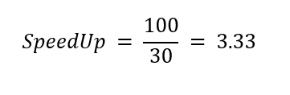
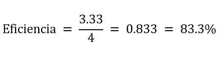

# Eficiencia Computacional

En computación de alto rendimiento, cuando paralelizamos un programa 
(correr con varios CPUs), queremos saber si realmente estamos obteniendo 
una mejora significativa.

Para esto se utilizan doms métricas fundamentales
* **SpeedUp**

* **Eficiencia**

- Se logra eficiencia cuando la medicion se mantiene sobre 0.5
- "Un programa no se ejecutará en la mitad de tiempo si se usa el doble de procesadores"
- Se busca hacer un uso optimo y eficiente de los recursos

## SpeedUp

El SpeedUp mide cuánto más rápido corre un programa al usar múltiples CPUs en comparación con una sola CPU.

La fórmula es:

<center>

   
   
</center>

donde: 
   * T1 = tiempo de ejecución con 1 CPU
   * Tn = timepo de ejecución con N CPU

Que se interpreta de la siguiente manera:
* *SpeedUP* = 1, No hay mejora
* *SpeedUp* = 2, El programa es el doble de rápido
* *SpeedUp ideal* = N, (lineal)

>**Ejemplo**
>
>   Si un programa tarda:
>   * 100 segundos con 1 CPU
>   * 30 segundso con 4 CPUs
>
>   entonces:
>
>   <center>
>
>   
>
>   </center>
>
>   Signifiaca que con 4 CPUs corre **3.33** veces más rápido

## Eficiencia

La *Eficiencia* mide qué tan bien se usan las CPUs adicionales.

Se calcula como:

<center>

   

</center>

donde:
* *N* = número total de CPUs utilizadas.

>**Ejemplo**
>
>Retomando el ejemplo anterior:
>
>SpeesUp = 3.33 con 4 CPUS. 
>
><center>
>
>   
>
></center>
>
>Que significa:
>* El programa usa **83% de la capacidad paralela ideal.**
>* El 17% restante se pierde por: 
>    * Comunicación entre procesoso
>    * operaciones secuenciales
>    * sincronización
>    * I/O, etc


```admonish title="Nota"
El *SpeddUp* **JAMÁS** será perfecto, la comunicación entre procesos, la 
sincronización y la parte secuencial del código limitan la *eficiencia.*
```


