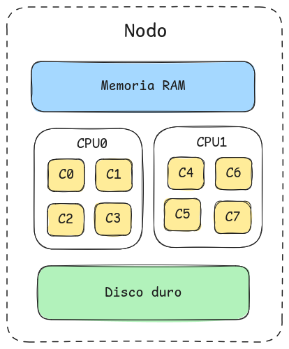
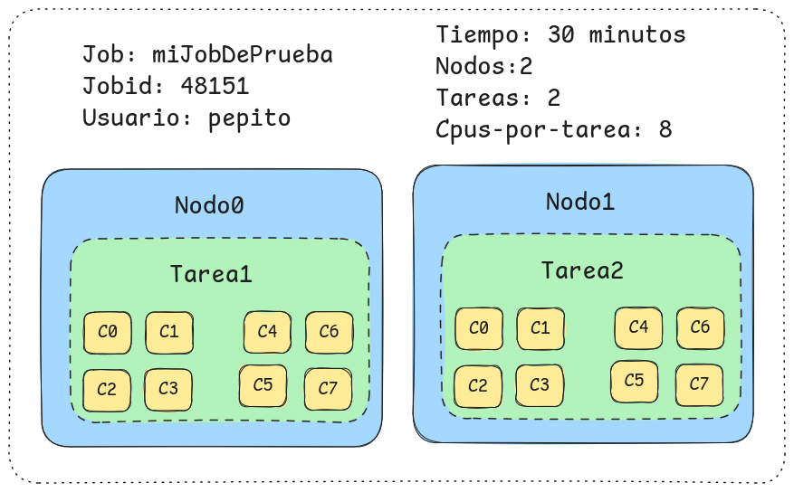
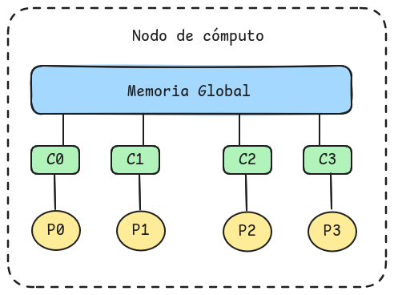
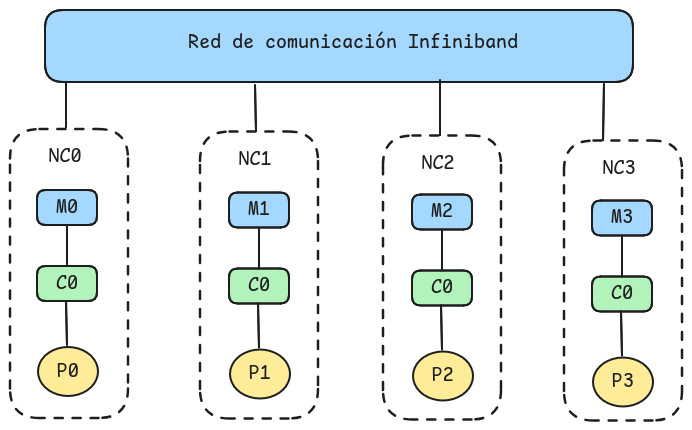
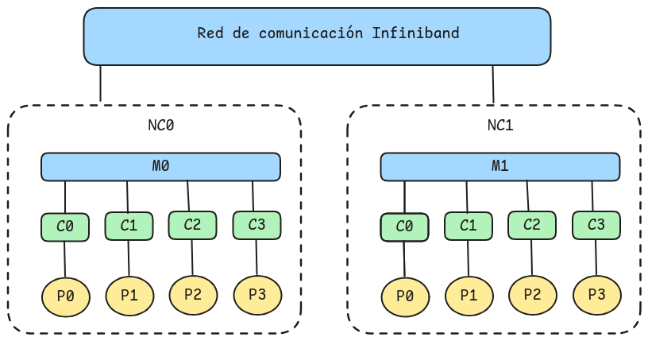

# Convenciones conceptuales para este taller y para Slurm

## Memoria
RAM (Random Access Memory o Memoria de Acceso Aleatorio) 
> - Componente que almacena los datos y las instrucciones que el procesador está utilizando de forma activa
> - Espacio de trabajo volátil de alta velocidad

## Socket
> Sección de un nodo donde se instala un CPU (físico)

Se usa de forma intercambiable con CPU, por eso preferimos socket

## Nucleo
> Unidad para procesamiento de datos que forma parte de un CPU

También llamado core o CPU

## Nodo
> Servidor o computadora con sockets, Memoria y Disco duro independiente

## Clúster
> Conjunto de nodos que comparten red de comunicación y sistema de archivos compartido

## Job
> Conjunto de recursos apartados para ser ejecutados,
- sujeto a ser encolado
- incluye
    - dueño
    - jobid
    - Numero de nodos
    - numero de tareas
    - tiempo máximo de ejecución

## Partición
> sección del cluster con características similares para formar trabajos

Se usa de forma intercambiable con cola

## Tarea
> - Subdivisión de recursos apartados por un job

- Se asocia a  un proceso
- Cada Job tiene al menos una tarea
- Cada nodo de un job requiere al menos un tarea
- cada tarea puede tener uno o mas nucleos asociados

## LUSTRE
> Sistema de archivos compartido y distribuido de alta velocidad

# Tipos de aplicaciones paralelas

> Una aplicación paralela hace que múltiples CPUs trabajen juntos en el
> mismo problema

Para hacer uso de la infraestructura del clúster, la clasificación de
aplicaciones más importante es:

- Acceso a la memoria
    - Memoria compartida
    - Memoria distribuida
- Uso de GPUs

## Acceso a la memoria
### Memoria compartida

Múltiples núcleos acceden a un único espacio de memoria
- la comunicación es muy rápida porque los datos no se "mueven"
- Utiliza la interfaz **OpenMP**
- Sólo se puede usar un nodo
- **Ejemplos de Aplicaciones:**  Gaussian

### Memoria distribuida

- Cada procesador tiene su propia memoria privada local
- Utiliza **MPI** (mpirun/mpiexec)
- Para que un procesador comunique su información deben enviarse mensajes a través de una red (InfiniBand)
- **Ejemplos de Aplicaciones:**  gromacs, lammps

### Esquema híbrido

### Uso de GPUS
- Dentro de una GPU, la arquitectura memoria compartida masivamente paralela (VRAM)
- Se pueden usar múltiples GPUS
	- Memoria compartida (NVlink)
	- Memoria distribuida
- **Ejemplos de Aplicaciones:**  gromacs, lammps

