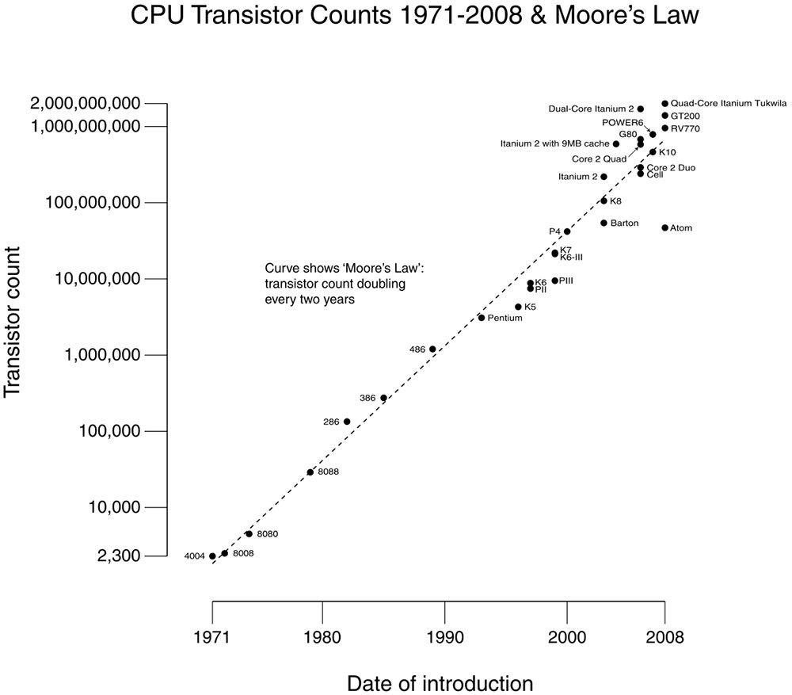

# High Performance Computing (HPC)

El objetivo principal del HPC es procesar grandes volúmenes de datos o ejecutar
simulaciones intensivas (como modelos climáticos, simulaciones físicas, genómica 
o inteligencia artificial).

**Sistema HPC:**

* Múltiples nodos trabajan en paralelo, comunicándose mediante una red 
de alta velocidad.

* Sistema de gestión de trabajos, como Slurm, para asignar tareas y recursos.

* Técnicas de computación paralela para dividir los problemas en partes 
más pequeñas que se ejecutan simultáneamente.

# Ley de Moore

La Ley de Moore es una observación hecha por Gordon Moore (cofundador de Intel) 
en 1965, que establece que el número de transistores en un chip se duplica 
aproximadamente cada dos años.

Aunque esta tendencia se mantuvo durante varias décadas, en los últimos años ha 
comenzado a desacelerarse debido a límites físicos en el tamaño de los transistores 
y problemas de consumo energético y calor.

# Computación Paralela

Es un modelo de procesamiento en el que varias tareas o cálculos se ejecutan 
simultáneamente, en lugar de hacerlo uno tras otro (como en la computación 
secuencial/serial).

Su objetivo principal es acelerar la ejecución de programas y aprovechar mejor 
los recursos del hardware, especialmente en sistemas con múltiples núcleos o 
procesadores.

El principio básico es: `Un problema grande se divide en partes más pequeñas que 
pueden resolverse al mismo tiempo en diferentes unidades de procesamiento 
(CPU, GPU, nodos de un clúster, etc.).`
	

**IMAGEN**

	

**Tipos de paralelismo**

* **Paralelismo de datos:** El mismo conjunto de instrucciones se aplica a distintos 
    fragmentos de datos (procesamiento de imágenes o simulaciones).

* **Paralelismo de tareas:** Diferentes tareas o funciones se ejecutan en paralelo 
    (servidores o pipelines).

* **Paralelismo híbrido:** Combina ambos enfoques para aprovechar al máximo los 
    recursos (MPI + OpenMP).

**Ventajas**

- Reduce significativamente el tiempo de ejecución.
- Permite resolver problemas complejos o de gran escala.
- Mejora el aprovechamiento del hardware disponible.

**Desafíos**

- Sincronización y comunicación entre procesos.
- División eficiente del trabajo (no todas las tareas se paralelizan bien).
- 
Sobrecarga de coordinación, que puede limitar el rendimiento.

# Computación Paralela VS Computación Serial

| **Aspecto** | **Serial** | **Paralela** |
|:-----------:|:----------:|:------------:|
| **Definición** | Ejecuta una instrucción a la vez, de forma lineal. | Ejecuta varias instrucciones simultáneamente en diferentes unidades de procesamiento. |
| **Ejecución de tareas** | Cada tarea se completa antes de iniciar la siguiente. | El problema se divide en sub-tareas que se procesan al mismo tiempo. |
| **Velocidad** | Más lenta para problemas grandes o complejos. | Mucho más rápida en tareas que pueden dividirse eficientemente. |
| **Uso de procesadores** | Utiliza un solo procesador o núcleo. | Utiliza múltiples núcleos, procesadores o nodos. |
| **Comunicación entre procesos** | No es necesaria. | Es esencial para coordinar tareas y compartir resultados. |
| **Escalabilidad** | Limitada: mejorar el rendimiento depende de un procesador más rápido. | Alta: el rendimiento puede aumentar añadiendo más procesadores. |

-----------------------------------------------------

# Paralelismo Implícito y Explícito

El paralelismo implícito y el paralelismo explícito se refieren a cómo se gestiona la 
ejecución paralela dentro de un programa, es decir, quién decide qué partes del código 
se ejecutan al mismo tiempo: el programador o el sistema (compilador/runtime).

**Paralelismo implícito**

En el paralelismo implícito, el compilador o el sistema se encarga automáticamente de 
detectar las partes del programa que pueden ejecutarse en paralelo.

- El programador no necesita especificar la división de tareas.

- Más fácil de implementar y mantener.

- Reduce errores de sincronización.

- Depende de la capacidad del compilador para identificar paralelismo.

**Paralelismo explícito**

En el paralelismo explícito, el programador define directamente qué partes 
del programa se ejecutan en paralelo y cómo se comunican entre sí.

- Mayor control sobre el rendimiento.

- Requiere más esfuerzo y conocimiento del hardware.

- El programador maneja la sincronización, comunicación y división de tareas.

| **Aspecto** | **Paralelismo Implícito** | **Paralelismo Explícito** |
|-------------|---------------------------|---------------------------|
| **Control** | Lo gestiona el compilador o sistema. | Lo gestiona el programador. |
| **Facilidad de uso** | Más sencillo, automático. | Más complejo, requiere experiencia. |
| **Optimización** | Limitada al análisis del compilador. | Puede alcanzar mayor rendimiento. |
| **Flexibilidad** |Menor. | Mayor (control detallado de recursos). |

# Memoria Compartida

Es un modelo de programación paralela en el que varios procesadores o hilos 
acceden al mismo espacio de memoria para leer y escribir datos.
Todos los procesos comparten una única copia de las variables, lo que 
facilita la comunicación y el intercambio de información entre ellos.

- Todos los hilos o procesadores ven el mismo contenido de memoria.

- La comunicación entre tareas se realiza mediante variables compartidas, 
no por paso de mensajes.

- Requiere mecanismos de sincronización (como mutex, semaforos o barreras) 
para evitar conflictos cuando varios hilos modifican los mismos datos.

**Ventajas**

- Comunicación rápida y directa entre tareas.

- Modelo más sencillo de programar en comparación con el paso de mensajes.

- Ideal para sistemas multinúcleo o multiprocesador con memoria común.

**Desventajas**

- Difícil de escalar a muchos procesadores (por problemas de coherencia de caché).

- Riesgo de condiciones de carrera si no se sincroniza correctamente el acceso a los datos.

- Menor portabilidad a sistemas distribuidos (donde cada nodo tiene su propia memoria).

