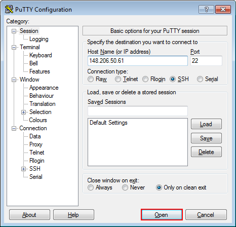

# Clúster Yoltla


# Infraestructura
Descripción de los nodos de procesamiento

# Accediendo al clúster

El acceso al clúster Yoltla es remoto y se realiza por medio de 2 
servidores llamados nodos de acceso. Para conectarse a los nodos 
de acceso se requiere de un shell seguro (secure shell / SSH).

| **Nombre del nodo**   | **Dirección IP**  | 
|:---------------------:|:-----------------:|
|       yoltla0         | 148.206.50.61     |
|       yoltla1         | 148.206.50.62     |

```admonish warning title="IMPORTANTE"
La primera conexión debe realizarse al nodo de acceso `yoltla0`.
```

## SSH GNU/Linux OS X

Desde la terminal ejecute el comando:
```
ssh -l <nombre de usuario> <dirección IP del nodo de acceso>
```

```admonish note title="NOTA"
Opción `-l` (letra ele minúscula).
```

Otra forma de realizar la conexión es utilizando la notación usuario@maquina:
```
ssh <nombre usuario>@<dirección IP del nodo de acceso>
```

## Windows

Utiliza [PuTTY](https://portableapps.com/apps/internet/putty_portable) para acceder 
al clúster con la siguiente información: 

-   **Host Name (or IP address):** 148.206.50.61
-   **Port:** 22
-   **Connection type:** SSH

La ventana de configuración debe quedar de la siguiente manera: 
<center>


</center>

Posteriormente, se abrirá una nueva ventana en donde se le solicitará su nombre de usuario y su 
contraseña:
<center>


</center>

# ¿Que es SLURM?

**SLURM** (Simple Linux Utility for Resource Management) es un sistema de 
gestión de trabajos y recursos de código abierto utilizado en clusters 
de computación de alto rendimiento (HPC).

Características principales:

* Gestor de colas: Organiza y planifica la ejecución de trabajos
* Administrador de recursos: Asigna CPU, memoria, GPU y otros recursos
* Escalable: Soporta desde pequeños clusters hasta supercomputadoras
* Tolerante a fallos: Capaz de recuperarse de fallos del sistema

**Componentes clave:**

* srun: Para lanzar trabajos paralelos
* sbatch: Para enviar trabajos por lotes


# Comandos principales de slurm

## sinfo - Información del estado del cluster 

```bash
    # Estado básico de los nodos
    sinfo

    # Información detallada
    sinfo -l

    # Mostrar particiones específicas
    sinfo -p particion1,particion2

    # Formato personalizado
    sinfo -o "%n %t %C %m"

    # Mostrar nodos por estado
    sinfo -N -o "%n %t %C %m"
```

## squeue - Estado de la cola de trabajos

``` bash
    # Ver todos los trabajos
    squeue

    # Trabajos de un usuario específico
    squeue -u nombre_usuario

    # Información detallada
    squeue -l

    # Trabajos en una partición específica
    squeue -p particion_gpu

    # Formato personalizado
    squeue -o "%.18i %.9P %.8j %.8u %.2t %.10M %.6D %R"

    # Trabajos pendientes
    squeue -t PENDING

    # Trabajos ejecutándose
    squeue -t RUNNING
```

Estados comunes:

- PD: Pendiente
- R: Ejecutándose
- CG: Completado
- F: Fallado
- CA: Cacelado


## sacct - Información de trabajos completados

```bash
    # Trabajos del día actual
    sacct

    # Trabajos de un usuario específico
    sacct -u nombre_usuario

    # Trabajos en un rango de fechas
    sacct -S 2024-01-01 -E 2024-01-02

    # Información detallada de un trabajo
    sacct -j 12345 -o jobid,jobname,partition,account,alloccpus,state,exitcode

    # Mostrar trabajos hijos de un array
    sacct -j 12345 --format=JobID,JobName,Partition,Account,AllocCPUS,State,ExitCode
```


## scontrol - Control y configuración

```bash
    # Información detallada de un trabajo
    scontrol show job 12345

    # Información de un nodo
    scontrol show node nodo01

    # Información de particiones
    scontrol show partition

    # Mantener un nodo
    scontrol update nodename=nodo01 state=DRAIN reason="mantenimiento"

    # Liberar un nodo
    scontrol update nodename=nodo01 state=RESUME

    # Modificar parámetros de un trabajo
    scontrol update jobid=12345 TimeLimit=60:00
```

## scancel - Cancelar trabajos

```bash
    # Cancelar un trabajo específico
    scancel 12345

    # Cancelar todos los trabajos de un usuario
    scancel -u nombre_usuario

    # Cancelar trabajos pendientes
    scancel -t PENDING -u nombre_usuario
```

# Directivas Slurm

Las directivas establecen las opciones con las que se va a ejecutar el trabajo.

|   **Directiva**         |   **Descripción**            |   **Uso**   |
|-------------------      |---------------------         |-------------|
|  --job-name=trabajo     |  Nombre del trabajo.         |  Opcional  |
|  --output=salida        |  Salida estándar.            |  Opcional  |
|  --error=error          |  Error estándar.             |  Opcional  |
|  --partition=partición  |  Nombre de la partición.     |  Obligatorio  |
|  --time=dd-hh:mm:ss     |  Tiempo máximo de ejecución. |  Obligatorio  |
|  --nodes=#              |  Número de nodos.            |  Obligatorio  |
|  --ntasks-per-node=#    |  Número de tareas por nodo.  |  Obligatorio  |
|  --cpus-per-task=#      |  Número de CPUs por tarea.   |  Obligatorio  |
|  --mem=#                |  Memoria por nodo.           |  Opcional     |
|  --mail-user=email      |  Correo electrónico del usuario.  |  Opcional  |
|  --mail-type=eventos    |  Eventos que se notificarán por correo electrónico.  |  Opcional  |

```admonish warning title="IMPORTANTE"
Sólo se utiliza la directiva:
    
    --cpus-per-task=#
    
cuando el programa usa memoria compartida (OpenMP).
```

# Srun 
    - ejercicio

# Sbatch
    - ejercicio

# Htop

# Lmod ó module avial?
    Cargar modulos en yoltla

# Cuota de discos?

# Eficiencia Computacional

# Dudas

    - htop
    - Reserva de RAM
    - Lmod
    - Cuota de discos
    - Uso de particiones GPUs
